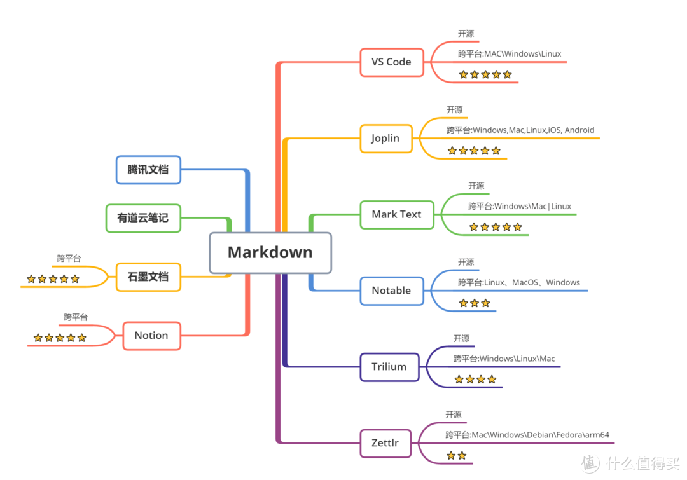

# 开发基础

> 版本控制工具、项目管理工具

* 版本控制工具
  * [git](基础工具/版本控制工具/git/)
  * [GitHub](基础工具/版本控制工具/github/)
  * svn
* 项目管理工具
  * [Ant](基础工具/项目管理工具/Ant/)
  * [maven](基础工具/项目管理工具/maven/)
  * [Gradle](基础工具/项目管理工具/gradle/)
* 绘图工具
  * [drawio](基础工具/绘图工具/drawio/)：免费
  * 思维导图
  * 框架图
* 文本编辑器
  * [Atom](基础工具/文本编辑器/Atom/)
  * [marktext](基础工具/文本编辑器/marktext/) 替代 Typora
  
  
