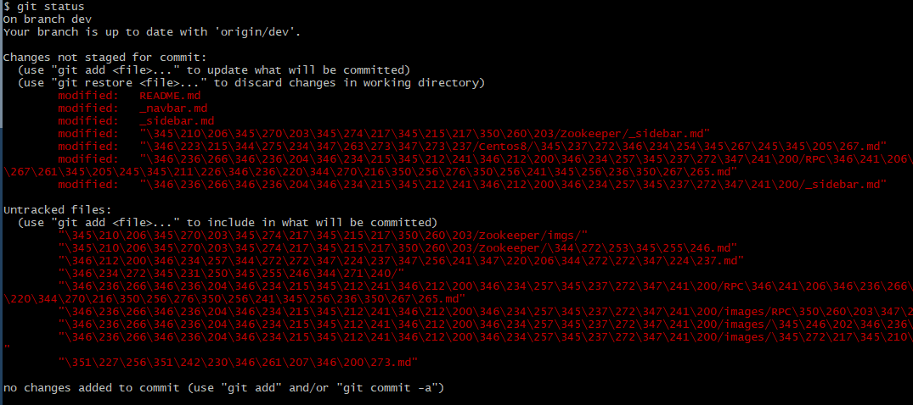
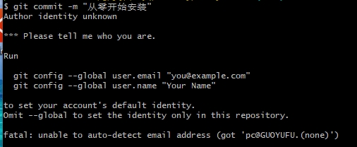

# FAQS 常见问答

## 重装系统导致文件所有权问题


致命错误：在存储库中侦测到可疑的所有权。

设置环境变量 `GIT_TEST_DEBUG_UNSAFE_DIRECTORIES=true` 并再次运行以了解更多信息。


## 路径中文字符

在 git bash 中，执行  `git status` 命令，文件路径中的中文全部显示为数字，像这样：



这是因为路径中的中文被转义，执行配置命令

``` bash
git config --global core.quotepath false
```

即可。

> 参考：https://git-scm.com/docs/git-config#Documentation/git-config.txt-corequotePath

再次执行 `git status` 命令，结果为


## 路径太长

在 git bash 中执行 `git clone`，报错“文件名太长”。


Windows 文件路径默认为 255 个字符。一些存储库可能提交了包含超过限制的路径的文件。默认情况下，Windows 下的 Git 不支持长路径，当试图对长文件名执行任何操作时，都会打印错误。设置配置属性将 `core.longpaths` 设置为 `true`，以允许某些 Git 操作正确处理这些文件。

> 参考：https://github.com/git-for-windows/git/wiki/FAQ#i-get-errors-trying-to-check-out-files-with-long-path-names

执行配置命令

``` bash
git config --global core.longpaths true
```

即可。

## 作者身份不明



根据提示进行配置

``` powershell
git config --global user.email "you@example.com"
git config --global user.name "Your Name"
```

比如，我的邮箱 `guoyufu_study@163.com` ，用户名 `guoyufu-study`。


## 每次 pull 都要输入账号密码

git bash 进入项目目录，输入：

```bash
git config --global credential.helper store
```

会在本地生成一个文本，上边记录账号和密码。

**使用上述的命令配置好之后，再操作一次git pull**，它会提示输入账号密码，这一次之后就不需要再次输入密码了。

## 文件名大小写不敏感问题

``` shell
# 先改文件名，再使用 git mv 命令
git mv readme.md README.md
```

