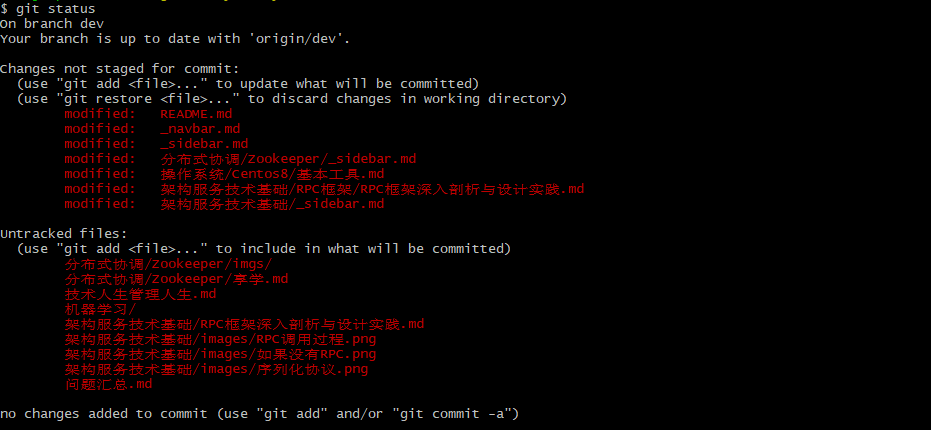

# FAQS 常见问答

## 路径中的中文被转义

在 git bash 中，执行  `git status` 命令，文件路径中的中文全部显示为数字，像这样：


这是因为路径中的中文被转义，执行配置命令

``` bash
git config --global core.quotepath false
```

即可。



## 路径太长

在 git bash 中执行 `git clone`，报错“文件名太长”。


官方方案在[这里](https://github.com/git-for-windows/git/wiki/FAQ#i-get-errors-trying-to-check-out-files-with-long-path-names)。执行配置

``` bash
git config --global core.longpaths true
```

## 每次 pull 都要输入账号密码

git bash 进入项目目录，输入：

```bash
git config --global credential.helper store
```

会在本地生成一个文本，上边记录账号和密码。

**使用上述的命令配置好之后，再操作一次git pull**，它会提示输入账号密码，这一次之后就不需要再次输入密码了。

## 文件名大小写不敏感问题

``` shell
# 先改文件名，再使用 git mv 命令
git mv readme.md README.md
```

