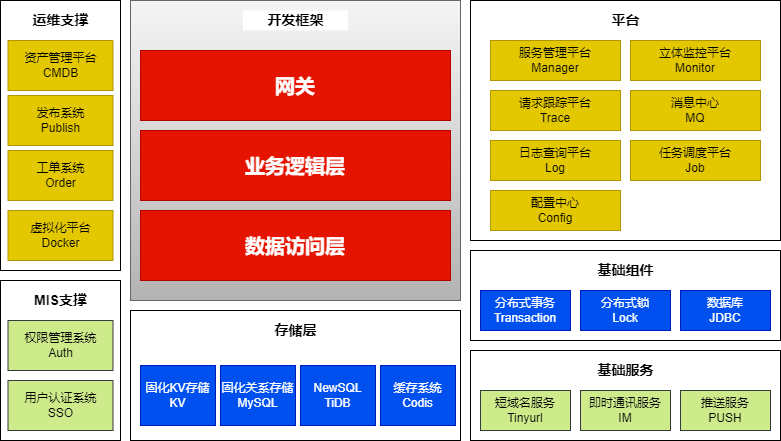

# 架构基础

> 各种基础技术

## 基础架构简介

### 开发框架

* [RPC框架](基础架构/RPC框架/)

### 平台

* [消息中心](基础架构/消息中心/)：多样性调用方式
* [立体监控平台](基础架构/立体监控平台/)
* [注册中心](基础架构/注册中心/)
* [配置中心](基础架构/配置中心/)
* [日志查询平台](基础架构/日志查询平台/)
* [请求跟踪平台](基础架构/请求跟踪平台/)
* [服务管理平台](基础架构/服务管理平台/)：管理整个RPC调用。谁有权限调用，谁部署了几个节点，每个节点能承载的流量，运行状况。
* [任务调度平台](基础架构/任务调度平台/)：大量定时任务。

### 基础组件

> 平台级组件，业务的通用解决方案

* 分布式事务
* 分布式锁
* 数据库： 分库、分表、路由、分片

### 基础服务

> 减轻业务线的工作量，让业务线只专注业务。

* 即时通讯服务：点对点触达沟通。
* 推送服务：服务器触达用户APP。用户可能不在线，APP可能已关闭，总之没链路链接可用。
* 短域名服务：活动落地页。长URL映射成短URL。短域名 302 跳转。

> 数字化营销名词：**落地页**。
>
> 营销页、竞价页、详情页，都可以是落地页
>
> 潜在用户通过站内Banner、站外信息流、搜索引擎等渠道点击进来时见到的第一个页面，目的是营销转化，说服用户完成我们指定的动作，比如填写信息、下载APP、购买产品和服务。
>
> 落地页不同于企业的专属官方网站

### 存储

* 固化 KV 存储：不通用，高可定制。可以认为就是分布式存储。
* 固化关系存储 MySQL：通用，可扩展性差。
* NewSQL 存储：支持 SQL，支持分布式。底层 kv，上面加一层 SQL 代理。比如，TiDB。
* 缓存系统 Codis

#### 选型

* MySQL：数据量少。单机 3T 磁盘，已经很大了。

* MySQL + Redis ：提升吞吐量和性能。单机 200G 内存，已经非常大了。

* MySQL 分库分表：MySQL 无分布式解决方案，分库分表让业务更复杂，某些查询不支持。

* 分布式存储 + 分布式缓存：理论可以无限扩展。TiDB 支持分布式存储。Codis 是 Redis 的分布式解决方案。

* 特殊需求：

  * 时序数据存储：比如，监控采集的数据。
  * 对象存储：MySQL 不适合存二进制数据，比如，图片，身份证验证信息。
    * Ceph：需要成熟的 C++ 团队，才能玩转，来实现定制需求。
    * FastDFS：轻量级，分布式文件存储。
  * 图数据库：描述复杂关系。一般业务开发用不到，风控、搜索推荐可能会用到，
    * Neo4J

  

### 运维支撑

* 资产管理平台
* 发布系统
* 工单系统
* 虚拟化平台

