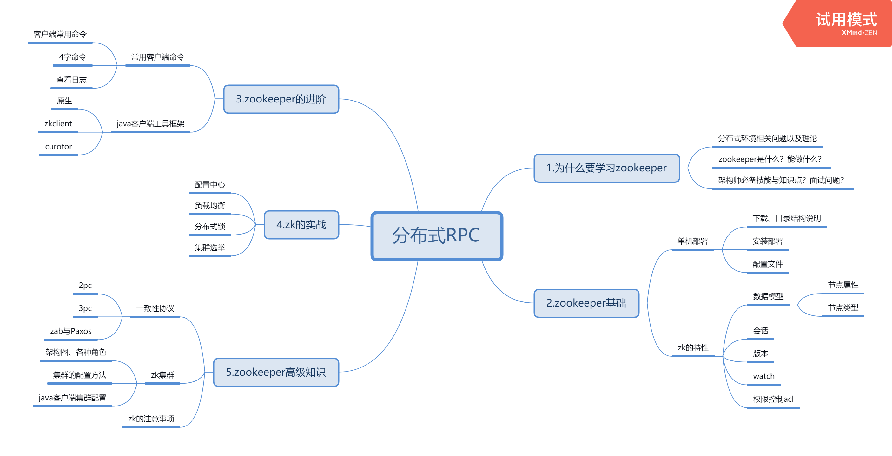

# 享学讲ZooKeeper

## 前置知识

* Linux 基本操作

## 课程总体介绍

!> ZooKeeper 是 Dubbo 和 Kafka 的前置知识。重点是**实战部分**。

## 为什么要学

### 分布式系统基础知识

单 tomcat **集中式部署**只应在管理系统、小型项目中使用。出现成本考虑，这种方案是值得提倡的。

#### 分布式系统及其特性

集中式系统：

分布式系统：一个硬件或软件组件分布在不同的网络计算机上，彼此之间仅仅通过消息传递进行通信和协调的系统

特点：分布性、对等性、并发性、缺乏全局时钟、故障随机会发生

##### 分布性

服务部署在不同的软件或硬件服务器，甚至不同的网络集群中。空间上是随意的，而且会随时增删服务器节点。

##### 对等性

在一个分布式系统中，要做到一个节点出问题的时候，有另外节点来顶替故障节点。这一个分布式设计需求，就要求故障节点和顶替节点是对等的，互为副本冗余。

分布式设计需求：服务副本冗余、数据副本冗余。

##### 并发性

多线程是并发的基础。这里从多进程，多JVM的角度来讨论并发。

在一个分布式系统中，多个节点可能会并发地操作一些共享资源。

分布式设计需求：准确并高效的协调分布式并发操作。

##### 缺乏全局时钟

每个节点都有自己的时间系统。在分布式系统中，由于缺乏一个全局的时钟序列进行控制，很难定义两个事务的先后。

现在已经不是大问题，已经有大把的时间服务器给系统调用。

##### 故障随时会发生

任何一个节点都可能出现停电、死机等现象，服务器集群越多，出现故障的可能性就越大，随着集群数目的增加，出现故障甚至都会成为一种常态。

分布式设计需求：在出现故障时，系统仍然能够提供正常的服务。

#### 分布式系统协调方法论

##### 现实问题

##### CAP理论

一致性、可用性、分区容错性

##### BASE理论

##### 分布式一致性算法

2p/3p、paxos、zab

### ZooKeeper 是什么？

ZooKeeper致力于提供一个高性能、高可用，且具备严格的顺序访问控制能力的分布式协调服务，是雅虎公司创建，是Google的Chubby一个开源的实现，也是Hadoop和Hbase的重要组件。

#### 设计目标

#### 使用场景

数据发布订阅、**负载均衡**、命名服务、**Master选举**、集群管理、**配置管理**、分布式队列、**分布式锁**

#### 为什么要学？

常见面试题

## 基础

### 单机部署

[下载](分布式协调/Zookeeper/Zookeeper文档?id=下载)、安装、启动、测试、停止

### 特性

##  进阶

## 实战

### 配置中心

### 负载均衡

### 分布式锁

### 集群选举

## 高级知识

## 分布式系统基础知识

## What & Why

