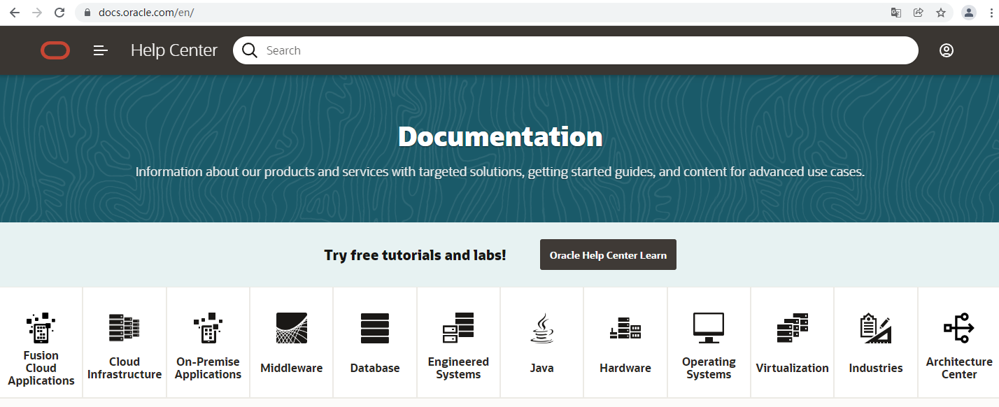
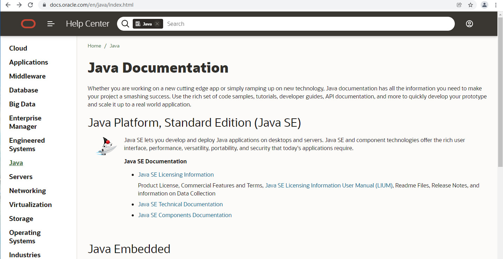

# Java 编程语言

> * 官方网站：
>
>   [Oracle Java](https://www.java.com/zh-CN/)  
>
> * API 文档：
>
>   [Java 11中文版 - API参考文档](https://www.apiref.com/java11-zh/index.html)  
>
>   [JDK 17 文档](https://docs.oracle.com/en/java/javase/17/)

[ORACLE中文官网](https://www.oracle.com/cn/index.html) 打开 [资源](https://www.oracle.com/cn/index.html#resources) 下拉菜单，在下拉菜单中点击 [文档](https://docs.oracle.com/en/) 进入**帮助中心**

点击 [Java](https://docs.oracle.com/en/java/index.html) 打开 Java 文档主页

